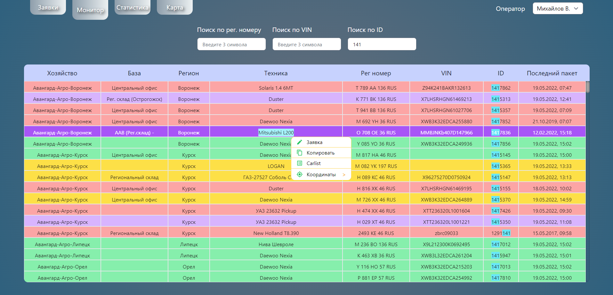
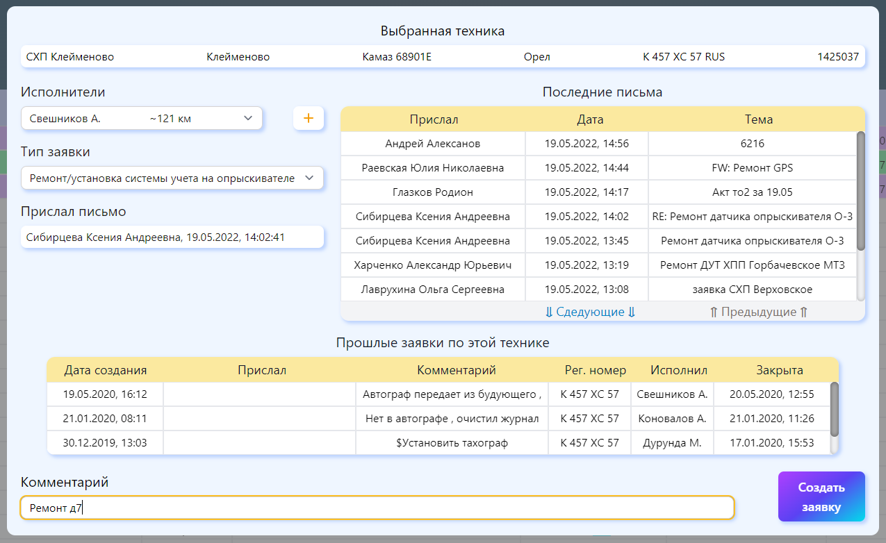
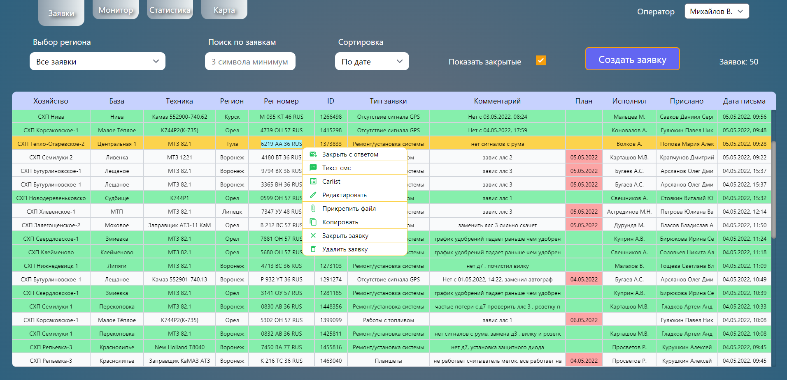
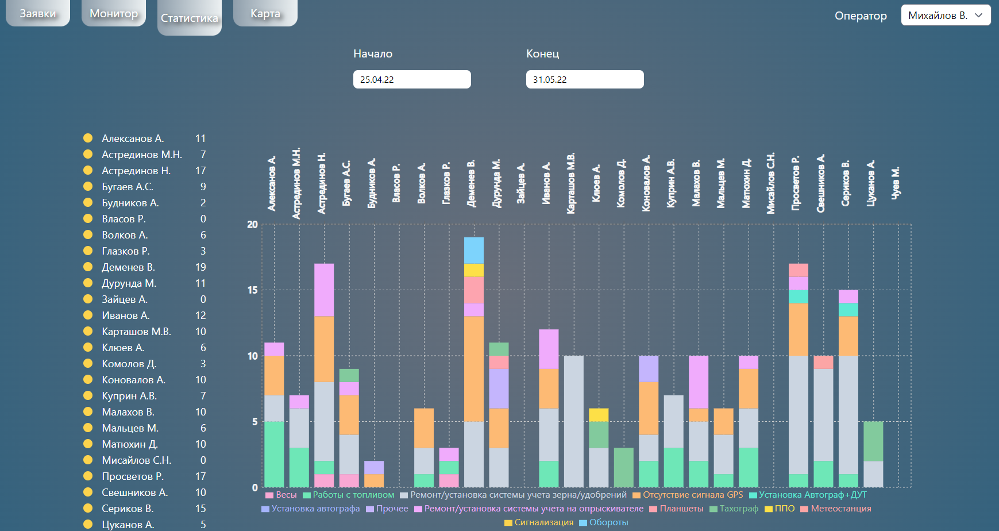
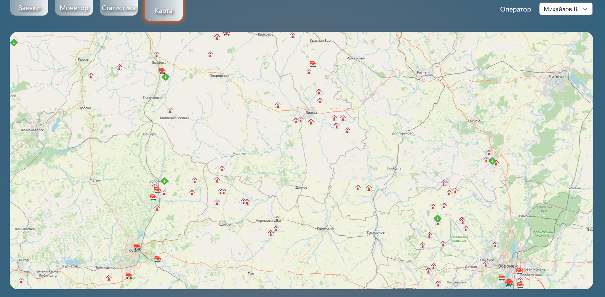

# Проект AgroServer
 
Этот проект выполняет задачу по фиксированию, редактированию заявок на обслуживание сельскохозяйственной техники и  инфраструктуры, связанной с сельским хозяйством. Заявки приходят по электронной почте от кураторов, обрабатываются оператором, для которого и написана программа и отсылаются исполнителям на местах для непосредственного исполнения.

Так как в работе используются базы данных организации, сделать живого демо не представляется возможным. Взаимодействие с программой представленно в ролике по ссылке ниже.

***

### Монитор

Точкой входа является вкладка "Монитор", в которой осуществляется поиск по базе oracle и выведение результатов поиска в таблицу. Цветовая дифференциация строк в таблице отражает временной лаг в поступлении последних данных с трекера техники.

Из контекстного меню таблицы можно:
* создать заявку на конретную технику из поиска, которые записываются в другую базу данных MongoDB
* преобразовать табличные данные по топливной тарировке бензобаков техники в строку данных для другой программы по мониторингу техники
* скопировать в буфер обмена координаты техники в янедкс или гугл формате
* скопировать данные выделения - по сути просто копирование, вместо стандартного копирования операционной системы
  
В модальном окне создания заявки нужно выбрать тип заявки, исполнителя, комментарий и письмо куратора, от которого пришла заявка. Письма тянутся с сервера outlook exchange. 
Исполнители в списке сортируются по дальности расположения от выбранной техники.
Так же, в этом окне можно увидеть предыдущие заявки, которые когда-либо были по этой технике.

### Заявки

Во вкладке "Заявки" отображаются заявки на устранение неисправностей, которые читаются из базы MongoDB.

Заявки можно сортировать по регионам, по дате, типу и статусу, хозяйству, к которому принадлежит техника, а также осуществлять поиск по ним. Отображение в таблице будет меняться в соответсвии с поисковыми запросами. Если заявка выполнена, то она отображается зелёным цветом.

В таблице заявок так же реализовано собственное контекстное меню, отскакивающее от краёв экрана, из которого можно сделать следующее: 

* закрыть заявку с ответом - изменяет статус заявки на "выполнено", открывает модальное окно с текстом ответного письма куратору (отправка писем работает через сервер outlook exchange) и обновляет список заявок.
* скопировать в буфер обмена информацию по заявке для отправки исполнителю
* редактировать какие-либо поля в заявке и записывать изменения в базу данных
* прикреплять акты выполненных работ к заявке: файлы копируются на сервер, откуда их можно сразу же и прочитать
* преобразовать табличные данные по топливной тарировке бензобаков  - так же, как во вкладке "Монитор"
* копировать, так же, как и во вкладке "Монитор"
* закрыть и удалить заявку, при этом подтвердив действие во всплывающем окне.

***

Таблица заявок подогнана по размерам под разрешение fullHD, так так работа приложения возможна только на десктопе. Некоторые несущественные поля не влезли в размер окна, чтобы не было прокрутки, поэтому они показываются во всплывающем окне при наведении на не некоторые поля таблицы.

Отсюда же можно создавать заявки на прочие виды работ, не относящиеся к конкретной технике.

### Статистика

На этой вкладке просто получаем статистику выполнения заявок по исполнителям за выбранный период.
Выбираем даты начала и окончания и получаем симпатичный график.

### Карта

На вкладке карты отображается карта с местоположением всех исполнителей, всех актуальных заявок и сельхоз баз. Здесь опрашиваем базы данных на предмет местоположения всех и выводим последовательно на карту.

## Технологии

В бэкэнде использовались:

* nodeJS
* Express
* MongoDB

На фронте:

* React
* TypeScript, в качестве практики
* MobX, как стейт менеджер
* Tailwind
* React Table для таблиц
* Framer для анимации страниц и компонентов

Собрано всё docker compose'ом из двух контейнеров: один для MongoDB, другой для сервера.